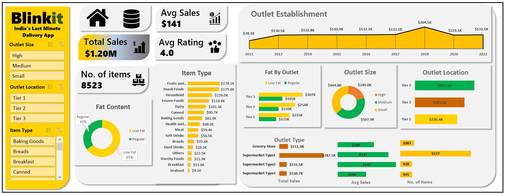

# 🛒 Blinkit Sales Analysis Dashboard

---

## 📌 Project Overview

This project presents an **Interactive Blinkit Sales Analysis Dashboard** built using **Microsoft Excel**.

The dashboard analyzes grocery retail data to uncover insights related to outlet performance, product characteristics, and customer preferences. It enables data-driven decision-making by identifying revenue trends and performance patterns across different outlet types and item categories.

---

## 🏷 Project Badges

---

## 📊 Dataset Description

Each row in the dataset represents an individual product sale across different Blinkit outlets.

### Columns Included:

- Item Fat Content  
- Sr.No  
- Item Identifier  
- Item Type  
- Outlet Establishment Year  
- Outlet Identifier  
- Outlet Location Type  
- Outlet Size  
- Outlet Type  
- Item Visibility  
- Item Weight  
- Sales  
- Rating  

---

## 🧹 Data Preparation & Transformation

The following steps were performed:

- Cleaned and standardized categorical fields  
- Verified missing values in Item Weight and Ratings  
- Structured data for Pivot Table analysis  
- Built calculated metrics for dashboard KPIs  

---

## 📈 Key Performance Indicators (KPIs)

The dashboard highlights:

- **Total Sales**
- **Average Sales**
- **Number of Items**
- **Average Rating**

These KPIs provide a high-level performance summary of overall retail sales.

---

## 📊 Dashboard Features

### 🔎 Interactive Filters (Slicers / Dropdowns)

- Outlet Size  
- Outlet Location Type  
- Item Type  

All visualizations dynamically update based on selected filters.

---

## 📉 Visualizations Included

- Sales by Outlet Establishment Year  
- Fat Content Distribution by Outlet  
- Sales by Outlet Size  
- Sales by Outlet Location Type  
- Sales by Outlet Type  

These charts help analyze historical trends and compare outlet-level performance.

---

## 🔍 Key Business Insights

- Outlet performance varies significantly by location type  
- Certain outlet sizes contribute higher overall sales  
- Product fat content influences sales distribution  
- Older outlets show different performance trends compared to newly established outlets  
- Ratings provide insight into product and outlet quality perception  

---
## Project Dashboard

## 🛠 Tools & Skills Used

### Tools:
- Microsoft Excel  
- Pivot Tables  
- Pivot Charts  
- Slicers  
- Data Cleaning  

### Skills Demonstrated:
- Retail Sales Analysis  
- KPI Development  
- Interactive Dashboard Design  
- Data Visualization  
- Business Insight Extraction  

---

## 🎯 Business Value

This dashboard enables stakeholders to:

- Evaluate outlet performance  
- Compare outlet sizes and location impact  
- Understand product category contribution  
- Support expansion and marketing strategies  
- Improve operational decision-making  

---

## 👨‍💻 Author

**Atharva Waikar** - Data Analyst  
Excel | Power BI | SQL | Data Visualization  

---

⭐ If you found this project helpful, consider giving it a star!
